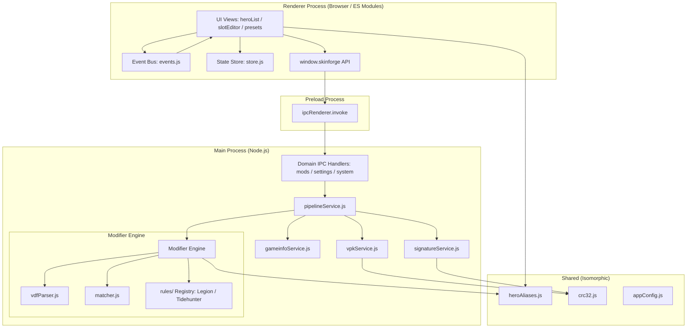

# Codebase Architecture Refactoring Implementation Plan

> **For agentic workers:** REQUIRED SUB-SKILL: Use superpowers:subagent-driven-development to implement this plan task-by-task. Steps use checkbox (`- [ ]`) syntax for tracking.

**Goal:** Reorganize Dota 2 SkinForge into clean, isolated architectural layers (`main`, `preload`, `renderer`, `shared`), eliminating code/data duplication, circular frontend dependencies, and blocking synchronous main thread operations.

**Architecture:** Split the codebase into a Node.js main process layer (`src/main/services` and `src/main/ipc`), an isomorphic shared utilities layer (`src/shared`), a secure preload layer (`src/preload`), and an event-driven frontend renderer layer (`src/renderer`). Modularize the 500-line monolithic `itemModifier.js` into a dedicated VDF parser, cosmetic matcher, and an extensible Arcana rule registry.

**Architecture Diagram:**



**Tech Stack:** Electron 33, Node.js (CommonJS for Main, ES Modules for Renderer), Source 2 VPK / KeyValues format.

**Spec:** [docs/superpowers/specs/2026-10-09-codebase-architecture-refactoring-design.md](file:///e:/My/dota2-skinforge/docs/superpowers/specs/2026-10-09-codebase-architecture-refactoring-design.md)

## Global Constraints

- Preserve all existing cosmetic patching behavior and mod safety guarantees.
- Main process remains CommonJS (`require`); Renderer process uses ES Modules (`import`/`export`).
- Shared modules in `src/shared/` must be consumable by both Node (`require`) and Browser (`import`).
- No UI visual regressions; existing CSS and design system tokens must remain intact.
- Avoid external npm dependencies; maintain lightweight zero-dependency architecture for core VPK and VDF tasks.

---

### Task 1: Extract Shared Utilities & Constants (`src/shared/`)

**Files:**
- Create: `src/shared/utils/crc32.js`
- Create: `src/shared/constants/heroAliases.js`
- Create: `src/shared/constants/appConfig.js`
- Create: `src/shared/constants/attributes.js`
- Test: `test/shared.test.js`

**Interfaces:**
- Consumes: `package.json`
- Produces: 
  - `crc32(buf)` -> `number`
  - `HERO_ALIASES` -> `Record<string, string>`
  - `getCanonicalHero(tag)` -> `string`
  - `APP_CONFIG` -> `{ name, shortName, modFolder, version, displayVersion, tagline }`
  - `HERO_ATTRIBUTES`, `getHeroAttribute(tag)`, `getAttrLabel(attr)`

- [ ] **Step 1: Write test for shared utilities**

Create `test/shared.test.js`:
```javascript
const assert = require('assert');
const { crc32 } = require('../src/shared/utils/crc32');
const { getCanonicalHero, HERO_ALIASES } = require('../src/shared/constants/heroAliases');
const { APP_CONFIG } = require('../src/shared/constants/appConfig');
const { getHeroAttribute, getAttrLabel } = require('../src/shared/constants/attributes');

// CRC32 verification
const buf = Buffer.from('GameInfo');
assert.strictEqual(typeof crc32(buf), 'number');

// Hero Aliases verification
assert.strictEqual(getCanonicalHero('zeus'), 'zuus');
assert.strictEqual(getCanonicalHero('necrophos'), 'necrolyte');
assert.strictEqual(getCanonicalHero('wraith king'), 'skeleton_king');

// App config verification
assert.strictEqual(APP_CONFIG.modFolder, 'skinforge');

// Attribute verification
assert.strictEqual(getHeroAttribute('pudge'), 'str');
assert.strictEqual(getHeroAttribute('antimage'), 'agi');
assert.strictEqual(getAttrLabel('str'), 'Strength');

console.log('Shared utilities test passed!');
```

- [ ] **Step 2: Run test to verify it fails**

Run: `node test/shared.test.js`  
Expected: FAIL with `Cannot find module '../src/shared/utils/crc32'`

- [ ] **Step 3: Implement `src/shared/utils/crc32.js`**

Universal CRC32 implementation:
```javascript
function crc32(buf) {
  let crc = ~0;
  for (let i = 0; i < buf.length; i++) {
    crc ^= buf[i];
    for (let j = 0; j < 8; j++) {
      crc = (crc >>> 1) ^ (-(crc & 1) & 0xEDB88320);
    }
  }
  return (~crc) >>> 0;
}

if (typeof module !== 'undefined' && module.exports) {
  module.exports = { crc32 };
}
```

- [ ] **Step 4: Implement `src/shared/constants/heroAliases.js`**

Universal Hero Aliases dictionary:
```javascript
const HERO_ALIASES = {
  'zeus': 'zuus',
  'windranger': 'windrunner',
  'necrophos': 'necrolyte',
  'wraith_king': 'skeleton_king',
  'wraith king': 'skeleton_king',
  'clockwerk': 'rattletrap',
  'timbersaw': 'shredder',
  'natures_prophet': 'furion',
  "nature's_prophet": 'furion',
  "nature's prophet": 'furion',
  'underlord': 'abyssal_underlord',
  'io': 'wisp',
  'magnus': 'magnataur',
  'shadow_fiend': 'nevermore',
  'shadow fiend': 'nevermore',
  'doom': 'doom_bringer',
  'lifestealer': 'life_stealer',
  'treant_protector': 'treant',
  'treant protector': 'treant',
  'queen_of_pain': 'queenofpain',
  'queen of pain': 'queenofpain',
  'outworld_destroyer': 'obsidian_destroyer',
  'outworld destroyer': 'obsidian_destroyer',
  'outworld_devourer': 'obsidian_destroyer',
  'outworld devourer': 'obsidian_destroyer',
  'vengeful_spirit': 'vengefulspirit',
  'vengeful spirit': 'vengefulspirit',
  'centaur_warrunner': 'centaur',
  'centaur warrunner': 'centaur',
  'anti-mage': 'antimage',
  'antimage': 'antimage'
};

function getCanonicalHero(heroTag) {
  if (!heroTag) return '';
  const raw = heroTag.toLowerCase().trim();
  const norm = raw.replace(/\s+/g, '_').replace(/-/g, '_');
  const clean = raw.replace(/[^a-z0-9]/g, '');
  return HERO_ALIASES[raw] || HERO_ALIASES[norm] || HERO_ALIASES[clean] || norm;
}

if (typeof module !== 'undefined' && module.exports) {
  module.exports = { HERO_ALIASES, getCanonicalHero };
}
```

- [ ] **Step 5: Implement `src/shared/constants/appConfig.js` and `attributes.js`**

Implement `src/shared/constants/appConfig.js` reading from `package.json` with fallback defaults, and move `src/data/attributes.js` to `src/shared/constants/attributes.js` with universal export support.

- [ ] **Step 6: Run test to verify it passes**

Run: `node test/shared.test.js`  
Expected: PASS

- [ ] **Step 7: Commit**

```bash
git add src/shared test/shared.test.js
git commit -m "feat(shared): extract shared utilities and constants"
```

---

### Task 2: Deduplicate Hero Catalogs & Optimize Asset Paths

**Files:**
- Modify: `data/heroes.json` (normalize relative image paths to root-relative `/assets/...`)
- Remove: `src/data/valveHeroCatalog.js` (delete redundant 2.35MB file)
- Maintain: `data/valveHeroCatalog.json` (move/retain single source in `data/`)
- Create: `test/catalog.test.js`

**Interfaces:**
- Consumes: `data/valveHeroCatalog.json`
- Produces: Verified valid JSON catalog structure without code duplication.

- [ ] **Step 1: Write test for catalog data validity**

Create `test/catalog.test.js`:
```javascript
const assert = require('assert');
const fs = require('fs');
const path = require('path');

const catalogPath = path.resolve(__dirname, '../data/valveHeroCatalog.json');
assert.strictEqual(fs.existsSync(catalogPath), true, 'valveHeroCatalog.json must exist in data/');

const catalog = JSON.parse(fs.readFileSync(catalogPath, 'utf8'));
assert.ok(catalog.pudge, 'Pudge catalog entry must exist');
assert.ok(Array.isArray(catalog.pudge.slots), 'Pudge slots must be an array');
assert.ok(catalog.pudge.items, 'Pudge items must exist');

console.log('Catalog data integrity test passed!');
```

- [ ] **Step 2: Copy catalog to `data/valveHeroCatalog.json` if not already present**

Ensure `data/valveHeroCatalog.json` has the content and remove `src/data/valveHeroCatalog.js`.

- [ ] **Step 3: Run test to verify catalog integrity**

Run: `node test/catalog.test.js`  
Expected: PASS

- [ ] **Step 4: Commit**

```bash
git add data/valveHeroCatalog.json test/catalog.test.js
git rm src/data/valveHeroCatalog.js 2>nul || git status
git commit -m "perf(data): deduplicate catalog into single authoritative JSON in data/"
```

---

### Task 3: Decouple Item Modifier Engine into Strategy Rules (`src/main/services/modifier/`)

**Files:**
- Create: `src/main/services/modifier/vdfParser.js`
- Create: `src/main/services/modifier/matcher.js`
- Create: `src/main/services/modifier/rules/legionCommander.js`
- Create: `src/main/services/modifier/rules/tidehunter.js`
- Create: `src/main/services/modifier/rules/index.js`
- Create: `src/main/services/modifier/modPackager.js`
- Create: `src/main/services/modifier/index.js`
- Test: `test/modifier.test.js`

**Interfaces:**
- Consumes: `items_game.txt` string, `equipped` loadouts map, `src/shared/constants/heroAliases`
- Produces:
  - `parseItemsGame(content)` -> `{ defaultItems, cosmetics }`
  - `applyModModifications(content, equipped)` -> `{ modifiedContent, patchedCount }`
  - `generateModPackage(dotaGameDir, stagingDir, equipped, onProgress)` -> `Promise<{ success, patchedCount }>`

- [ ] **Step 1: Write test for modular item modifier**

Create `test/modifier.test.js`:
```javascript
const assert = require('assert');
const { parseItemsGame } = require('../src/main/services/modifier/vdfParser');
const { applyModModifications } = require('../src/main/services/modifier/index');

const sampleVdf = `
"items_game"
{
	"items"
	{
		"1"
		{
			"name"		"weapon_axe_default"
			"prefab"	"default_item"
			"item_slot"	"weapon"
			"used_by_heroes"
			{
				"npc_dota_hero_axe"		"1"
			}
			"model_player"		"models/heroes/axe/axe_weapon.vmdl"
		}
		"200"
		{
			"name"		"Axe of Phractos"
			"prefab"	"wearable"
			"item_slot"	"weapon"
			"used_by_heroes"
			{
				"npc_dota_hero_axe"		"1"
			}
			"model_player"		"models/items/axe/phractos.vmdl"
		}
	}
}
`;

const parsed = parseItemsGame(sampleVdf);
assert.strictEqual(parsed.defaultItems.length, 1);
assert.strictEqual(parsed.cosmetics.length, 1);

const result = applyModModifications(sampleVdf, {
  'axe': { 'weapon': 'Axe of Phractos' }
});

assert.strictEqual(result.patchedCount, 1);
assert.ok(result.modifiedContent.includes('models/items/axe/phractos.vmdl'));
console.log('Modifier engine test passed!');
```

- [ ] **Step 2: Run test to verify failure**

Run: `node test/modifier.test.js`  
Expected: FAIL with `Cannot find module`

- [ ] **Step 3: Implement `vdfParser.js`**

Extract `parseItemsGame` from `src/core/itemModifier.js` with clean substring boundary scanning into `src/main/services/modifier/vdfParser.js`.

- [ ] **Step 4: Implement `matcher.js`**

Extract `normalizeName`, `normalizeSlot`, `findBestCosmetic`, and `findDefaultItem` into `src/main/services/modifier/matcher.js`, utilizing `src/shared/constants/heroAliases.js`.

- [ ] **Step 5: Implement `rules/` registry**

Extract Legion Commander and Tidehunter Arcana multi-slot override routines into `rules/legionCommander.js` and `rules/tidehunter.js`. In `rules/index.js`, export an array of rule handlers:
```javascript
const legionCommander = require('./legionCommander');
const tidehunter = require('./tidehunter');

module.exports = [legionCommander, tidehunter];
```

- [ ] **Step 6: Implement `modPackager.js` and `index.js`**

Implement `applyModModifications` in `src/main/services/modifier/index.js`, looping through equipped slots and iterating over matched rules from the `rules/` registry. Implement `generateModPackage` in `modPackager.js`.

- [ ] **Step 7: Run test to verify it passes**

Run: `node test/modifier.test.js`  
Expected: PASS

- [ ] **Step 8: Commit**

```bash
git add src/main/services/modifier test/modifier.test.js
git commit -m "feat(modifier): modularize VDF parser, matcher, and Arcana rules"
```

---

### Task 4: Main Process Domain Services with Non-Blocking Async I/O (`src/main/services/`)

**Files:**
- Create: `src/main/services/dotaPathService.js`
- Create: `src/main/services/gameinfoService.js`
- Create: `src/main/services/signatureService.js`
- Create: `src/main/services/vpkService.js`
- Create: `src/main/services/pipelineService.js`
- Test: `test/services.test.js`

**Interfaces:**
- Consumes: `src/shared/utils/crc32.js`, `src/shared/constants/appConfig.js`, `src/main/services/modifier/index.js`
- Produces:
  - `dotaPathService.detectDotaPath()`, `isValidDotaGameDir(dir)`
  - `gameinfoService.injectSearchPaths(dir, modFolder, backupDir)`, `restoreCleanGameinfo(dir, backupDir)`
  - `signatureService.updateSignaturesForGameinfo(dir, backupDir)`, `restoreSignatures(dir, backupDir)`
  - `vpkService.pack(srcDir, outVpkPath)`, `vpkService.list(vpkPath)`, `vpkService.extract(...)`
  - `pipelineService.checkStatus(dotaDir)`, `pipelineService.installMods(...)`, `pipelineService.uninstallMods(...)`

- [ ] **Step 1: Write test for services**

Create `test/services.test.js`:
```javascript
const assert = require('assert');
const gameinfoService = require('../src/main/services/gameinfoService');
const signatureService = require('../src/main/services/signatureService');
const pipelineService = require('../src/main/services/pipelineService');

assert.strictEqual(typeof pipelineService.checkStatus, 'function');
assert.strictEqual(typeof pipelineService.installMods, 'function');
assert.strictEqual(typeof pipelineService.isDotaRunning, 'function');
console.log('Services structure test passed!');
```

- [ ] **Step 2: Implement `src/main/services/dotaPathService.js`**

Port detection logic with clean async/sync utilities from `src/core/dotaPath.js`.

- [ ] **Step 3: Implement `src/main/services/gameinfoService.js`**

Port search path injection and restoration from `src/core/gameinfo.js`, consuming `APP_CONFIG.modFolder`.

- [ ] **Step 4: Implement `src/main/services/signatureService.js`**

Port signature patching and SHA1/CRC32 calculation using `src/shared/utils/crc32.js`.

- [ ] **Step 5: Implement `src/main/services/vpkService.js`**

Port multi-chunk VPK packing using `src/shared/utils/crc32.js` and async child process execution.

- [ ] **Step 6: Implement `src/main/services/pipelineService.js`**

Coordinate `checkStatus`, `installMods`, and `uninstallMods` with async execution and step progress reporting.

- [ ] **Step 7: Run test to verify services**

Run: `node test/services.test.js`  
Expected: PASS

- [ ] **Step 8: Commit**

```bash
git add src/main/services test/services.test.js
git commit -m "feat(services): implement modular domain services in src/main/services"
```

---

### Task 5: Domain-Driven IPC Handlers & Main Process Entry (`src/main/`)

**Files:**
- Create: `src/main/ipc/modsIpc.js`
- Create: `src/main/ipc/settingsIpc.js`
- Create: `src/main/ipc/systemIpc.js`
- Create: `src/main/ipc/index.js`
- Create: `src/main/index.js`
- Modify: `package.json` (`"main": "src/main/index.js"`)
- Remove: empty `main-process/` directory

**Interfaces:**
- Consumes: Services from `src/main/services/`
- Produces: Electron IPC channels (`get-initial-data`, `check-status`, `select-directory`, `install-mods`, `uninstall-mods`, `read-settings`, `write-settings`, `open-external`).

- [ ] **Step 1: Implement `src/main/ipc/modsIpc.js`**

Handles `install-mods`, `uninstall-mods`, `check-status`.

- [ ] **Step 2: Implement `src/main/ipc/settingsIpc.js`**

Handles `read-settings`, `write-settings`, `select-directory`.

- [ ] **Step 3: Implement `src/main/ipc/systemIpc.js`**

Handles `get-initial-data`, `open-external`.

- [ ] **Step 4: Implement `src/main/ipc/index.js`**

Exports `registerIpcHandlers(mainWindow)`.

- [ ] **Step 5: Implement `src/main/index.js`**

Clean Electron entry point with single-instance lock, window creation, preload setup, and IPC registration.

- [ ] **Step 6: Update `package.json` entry point**

Change `"main": "main.js"` to `"main": "src/main/index.js"`.

- [ ] **Step 7: Verify Node syntax on all main files**

Run:
```powershell
node -c src/main/index.js; node -c src/main/ipc/index.js; node -c src/main/services/pipelineService.js
```
Expected: No syntax errors.

- [ ] **Step 8: Commit**

```bash
git add src/main package.json
git commit -m "feat(main): establish domain-driven IPC handlers and modular main entry"
```

---

### Task 6: Preload Bridge & Shared IPC Contract (`src/preload/`)

**Files:**
- Create: `src/preload/index.js`
- Maintain backward-compatibility: update root `preload.js` to delegate to `src/preload/index.js`

**Interfaces:**
- Consumes: `ipcRenderer`, `src/shared/constants/appConfig`
- Produces: `window.skinforge` and `window.appInfo` contextBridge APIs.

- [ ] **Step 1: Implement `src/preload/index.js`**

```javascript
const { contextBridge, ipcRenderer } = require('electron');
const { APP_CONFIG } = require('../shared/constants/appConfig');

const api = {
  appInfo: APP_CONFIG,
  getInitialData: () => ipcRenderer.invoke('get-initial-data'),
  checkStatus: (p) => ipcRenderer.invoke('check-status', p),
  selectDirectory: () => ipcRenderer.invoke('select-directory'),
  installMods: (p, equipped) => ipcRenderer.invoke('install-mods', p, equipped),
  uninstallMods: (p) => ipcRenderer.invoke('uninstall-mods', p),
  openExternal: (url) => ipcRenderer.invoke('open-external', url),
  readSettings: () => ipcRenderer.invoke('read-settings'),
  writeSettings: (s) => ipcRenderer.invoke('write-settings', s),
  onInstallProgress: (cb) => ipcRenderer.on('install-progress', (_e, d) => cb(d))
};

contextBridge.exposeInMainWorld('appInfo', APP_CONFIG);
contextBridge.exposeInMainWorld('skinforge', api);
```

- [ ] **Step 2: Update root `preload.js` and `main.js` compatibility delegate**

Keep thin redirect in root `preload.js` and `main.js` so `npm start` works identically whether invoked with legacy root path or `src/main/index.js`.

- [ ] **Step 3: Commit**

```bash
git add src/preload preload.js
git commit -m "feat(preload): secure IPC context bridge in src/preload"
```

---

### Task 7: Frontend Event Bus & State Store (`src/renderer/state/`)

**Files:**
- Create: `src/renderer/state/events.js`
- Create: `src/renderer/state/store.js`

**Interfaces:**
- Consumes: `localStorage`
- Produces:
  - `on(event, handler)`, `emit(event, data)`
  - `store.getState()`, `store.setSelectedHero(hero)`, `store.setEquippedItem(heroTag, slotId, item)`, `store.resetHeroSlots(heroTag)`, `store.loadPresets()`, `store.savePreset(name)`

- [ ] **Step 1: Implement `src/renderer/state/events.js`**

```javascript
const bus = new EventTarget();

export function on(event, callback) {
  bus.addEventListener(event, (e) => callback(e.detail));
}

export function emit(event, detail) {
  bus.dispatchEvent(new CustomEvent(event, { detail }));
}
```

- [ ] **Step 2: Implement `src/renderer/state/store.js`**

Centralize state and persistence with event broadcasting on state mutations (e.g. `emit('slots:updated', { heroTag })`).

- [ ] **Step 3: Commit**

```bash
git add src/renderer/state
git commit -m "feat(renderer): add decoupled event bus and state store"
```

---

### Task 8: Frontend Components Decoupling (`src/renderer/components/`)

**Files:**
- Move & Refactor: `src/modules/heroList.js` -> `src/renderer/components/heroList.js`
- Move & Refactor: `src/modules/slotEditor.js` -> `src/renderer/components/slotEditor.js`
- Move & Refactor: `src/modules/presets.js` -> `src/renderer/components/presetsView.js`
- Move & Refactor: `src/modules/settings.js` -> `src/renderer/components/settingsView.js`
- Move & Refactor: `src/modules/navigation.js` -> `src/renderer/components/navigation.js`
- Move & Refactor: `src/modules/launchTweaks.js` -> `src/renderer/components/launchView.js`
- Move & Refactor: `src/modules/dom.js` -> `src/renderer/utils/dom.js`
- Move & Refactor: `src/modules/logger.js` -> `src/renderer/utils/logger.js`
- Move & Refactor: `src/modules/itemImages.js` -> `src/renderer/utils/itemImages.js`
- Update: `src/renderer/index.js` (master orchestrator wiring event listeners)
- Update: `src/index.html` (script import points to `./renderer/index.js`)

**Interfaces:**
- `heroList.js` listens to `'slots:updated'` to update slot badge count without importing `slotEditor.js`.
- `heroList.js` emits `'hero:selected'` when a hero is clicked.
- `slotEditor.js` listens to `'hero:selected'` and renders slots without importing `heroList.js`.
- Zero circular imports between components!

- [ ] **Step 1: Refactor `heroList.js` to use event bus**

Remove `import { renderHeroSlots } from './slotEditor.js'`. When a hero is clicked, call `store.setSelectedHero(hero)` and `emit('hero:selected', hero)`.

- [ ] **Step 2: Refactor `slotEditor.js` to use event bus**

Remove `import { renderHeroList } from './heroList.js'`. Listen to `'hero:selected'`. On slot reset or equip, call `store.setSlot(...)` and `emit('slots:updated', { heroTag })`.

- [ ] **Step 3: Refactor `presetsView.js` and other views**

Remove direct cross-component calls, using the event bus for view refreshes.

- [ ] **Step 4: Wire up `src/renderer/index.js` and `src/index.html`**

Update `src/index.html` to load `<script type="module" src="./renderer/index.js"></script>`.

- [ ] **Step 5: Commit**

```bash
git add src/renderer src/index.html
git commit -m "refactor(renderer): break circular dependencies and wire event-driven components"
```

---

### Task 9: Clean Legacy Directories & Stale Files

**Files:**
- Remove: `main-process/` (empty directory)
- Remove: `src/core/` (replaced by `src/main/services/`)
- Remove: `src/modules/` (replaced by `src/renderer/components/` and `src/renderer/utils/`)
- Remove: `src/config/` (replaced by `src/shared/constants/`)
- Remove: `src/renderer.js` (replaced by `src/renderer/index.js`)

- [ ] **Step 1: Check for any remaining references to `src/core` or `src/modules`**

Run: `grep "src/core" src/` and `grep "src/modules" src/`. Verify zero remaining legacy references.

- [ ] **Step 2: Remove legacy directories and files**

Clean out old legacy paths.

- [ ] **Step 3: Commit**

```bash
git add -A
git commit -m "chore(cleanup): remove deprecated legacy modules and core folders"
```

---

### Task 10: End-to-End Verification & Sanity Test

**Files:**
- Verify: `npm start` / launch smoke test
- Test: All automated unit tests in `test/`

- [ ] **Step 1: Run all test suites**

Run: `node test/shared.test.js; node test/catalog.test.js; node test/modifier.test.js; node test/services.test.js`  
Expected: All tests PASS.

- [ ] **Step 2: Launch application via Electron in test mode**

Launch Electron to ensure window renders without preload errors or unhandled console exceptions.

- [ ] **Step 3: Commit any final tweaks**

```bash
git add -A
git commit -m "test: verify all architectural refactoring tests pass"
```
