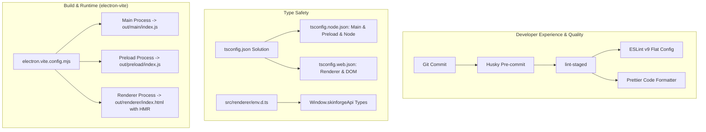

# Modern Developer Toolchain Implementation Plan

> **For agentic workers:** REQUIRED SUB-SKILL: Use superpowers:subagent-driven-development to implement this plan task-by-task. Steps use checkbox (`- [ ]`) syntax for tracking.

**Goal:** Transform Dota 2 SkinForge into a modern, developer-friendly project with `electron-vite` (HMR & bundling), multi-environment TypeScript, ESLint v9 Flat Config, Prettier, and Husky + lint-staged pre-commit hooks while maintaining 100% backward compatibility for existing JavaScript modules.

**Architecture:** We use `electron-vite` to bundle main, preload, and renderer processes. TypeScript is configured via solution project references (`tsconfig.node.json` and `tsconfig.web.json`) with `allowJs: true` for zero-breakage incremental adoption, while `env.d.ts` injects complete type safety for Electron IPC APIs in the renderer. ESLint v9 and Prettier handle logic and styling separately, orchestrated by Husky pre-commit hooks.

**Architecture Diagram:**



**Tech Stack:**
- `electron-vite` ^2.3.0 / `vite` ^5.0.0
- `typescript` ^5.5.0
- `eslint` ^9.0.0, `@eslint/js`, `typescript-eslint`, `eslint-config-prettier`
- `prettier` ^3.3.0
- `husky` ^9.1.0, `lint-staged` ^15.2.0
- `electron` ^33.0.0

**Spec:** [`docs/superpowers/specs/2026-10-09-electron-vite-ts-lint-prettier-design.md`](file:///e:/My/dota2-skinforge/docs/superpowers/specs/2026-10-09-electron-vite-ts-lint-prettier-design.md)

## Global Constraints
- Do not break existing JavaScript runtime behavior (`allowJs: true`, no mandatory `.ts` file renames in the initial setup).
- Preserve existing IPC handler names and signatures across main and preload.
- Ensure all existing unit tests in `test/` continue to pass without regression.
- Keep dependencies as devDependencies unless strictly required at production runtime.

---

### Task 1: Install Developer Tooling Dependencies & Husky

**Files:**
- Modify: [`package.json`](file:///e:/My/dota2-skinforge/package.json)
- Create: `.husky/pre-commit`

**Interfaces:**
- Produces: Installed devDependencies in `package.json` and node_modules; active Husky hook in `.husky/pre-commit`.

- [ ] **Step 1: Install dev dependencies via npm**

Run command to install tooling:
```bash
npm install -D electron-vite vite typescript @types/node eslint @eslint/js typescript-eslint prettier eslint-config-prettier husky lint-staged
```

- [ ] **Step 2: Initialize Husky and add pre-commit hook**

Initialize Husky:
```bash
npx husky init
```
Write `.husky/pre-commit` with:
```bash
npx lint-staged
```

- [ ] **Step 3: Add lint-staged configuration in package.json**

Add to `package.json`:
```json
"lint-staged": {
  "*.{js,ts,mjs}": [
    "eslint --fix",
    "prettier --write"
  ],
  "*.{json,css,html,md}": [
    "prettier --write"
  ]
}
```

- [ ] **Step 4: Verify package installation**

Run: `npm list electron-vite typescript eslint prettier husky lint-staged --depth=0`
Expected: All packages listed without missing peer dependency errors.

- [ ] **Step 5: Commit**

```bash
git add package.json package-lock.json .husky/
git commit -m "chore(tooling): install electron-vite, typescript, eslint, prettier, husky"
```

---

### Task 2: Configure Prettier and ESLint (v9 Flat Config)

**Files:**
- Create: [`.prettierrc`](file:///e:/My/dota2-skinforge/.prettierrc)
- Create: [`.prettierignore`](file:///e:/My/dota2-skinforge/.prettierignore)
- Create: [`eslint.config.mjs`](file:///e:/My/dota2-skinforge/eslint.config.mjs)
- Modify: [`package.json`](file:///e:/My/dota2-skinforge/package.json) (scripts)

**Interfaces:**
- Produces: `npm run lint`, `npm run lint:fix`, `npm run format`, `npm run format:check`.

- [ ] **Step 1: Create Prettier configuration files**

Write `.prettierrc`:
```json
{
  "semi": true,
  "singleQuote": true,
  "tabWidth": 2,
  "trailingComma": "es5",
  "printWidth": 100
}
```

Write `.prettierignore`:
```
node_modules/
out/
dist/
build/
data/
package-lock.json
*.zip
*.vpk
```

- [ ] **Step 2: Create ESLint Flat Config (`eslint.config.mjs`)**

Write `eslint.config.mjs`:
```javascript
import js from '@eslint/js';
import tseslint from 'typescript-eslint';
import prettier from 'eslint-config-prettier';

export default [
  {
    ignores: [
      'out/**',
      'dist/**',
      'node_modules/**',
      'data/**',
      'tools/**',
      '.staging_pack/**',
      'package-lock.json'
    ]
  },
  js.configs.recommended,
  ...tseslint.configs.recommended,
  prettier,
  {
    languageOptions: {
      ecmaVersion: 'latest',
      sourceType: 'module',
      globals: {
        node: true,
        browser: true,
        es2022: true
      }
    },
    rules: {
      'no-console': 'off',
      '@typescript-eslint/no-unused-vars': [
        'warn',
        { argsIgnorePattern: '^_', varsIgnorePattern: '^_' }
      ],
      'no-unused-vars': [
        'warn',
        { argsIgnorePattern: '^_', varsIgnorePattern: '^_' }
      ],
      '@typescript-eslint/no-explicit-any': 'off',
      '@typescript-eslint/no-require-imports': 'off'
    }
  }
];
```

- [ ] **Step 3: Add lint and format scripts to package.json**

Add to `"scripts"` in `package.json`:
```json
"lint": "eslint .",
"lint:fix": "eslint . --fix",
"format": "prettier --write \"src/**/*.{js,ts,css,html}\"",
"format:check": "prettier --check \"src/**/*.{js,ts,css,html}\""
```

- [ ] **Step 4: Run format and lint checks to verify**

Run: `npm run format`
Run: `npm run lint:fix`
Run: `npm run format:check`
Expected: Formats files cleanly and passes with zero fatal errors.

- [ ] **Step 5: Commit**

```bash
git add .prettierrc .prettierignore eslint.config.mjs package.json
git commit -m "chore(lint): configure prettier and eslint v9 flat config"
```

---

### Task 3: Configure TypeScript Multi-Environment Solution & Declarations

**Files:**
- Create: [`tsconfig.json`](file:///e:/My/dota2-skinforge/tsconfig.json)
- Create: [`tsconfig.node.json`](file:///e:/My/dota2-skinforge/tsconfig.node.json)
- Create: [`tsconfig.web.json`](file:///e:/My/dota2-skinforge/tsconfig.web.json)
- Create: [`src/renderer/env.d.ts`](file:///e:/My/dota2-skinforge/src/renderer/env.d.ts)
- Modify: [`package.json`](file:///e:/My/dota2-skinforge/package.json) (scripts)

**Interfaces:**
- Consumes: Node and DOM types.
- Produces: `npm run typecheck`, full TypeScript autocomplete for `window.skinforgeApi`.

- [ ] **Step 1: Create tsconfig solution root (`tsconfig.json`)**

Write `tsconfig.json`:
```json
{
  "files": [],
  "references": [
    { "path": "./tsconfig.node.json" },
    { "path": "./tsconfig.web.json" }
  ]
}
```

- [ ] **Step 2: Create Node context config (`tsconfig.node.json`)**

Write `tsconfig.node.json`:
```json
{
  "compilerOptions": {
    "composite": true,
    "target": "ES2022",
    "module": "ESNext",
    "moduleResolution": "bundler",
    "allowJs": true,
    "checkJs": false,
    "strict": false,
    "noEmit": true,
    "types": ["node"]
  },
  "include": [
    "src/main/**/*",
    "src/preload/**/*",
    "src/shared/**/*",
    "scripts/**/*",
    "test/**/*",
    "electron.vite.config.*"
  ]
}
```

- [ ] **Step 3: Create Web context config (`tsconfig.web.json`)**

Write `tsconfig.web.json`:
```json
{
  "compilerOptions": {
    "composite": true,
    "target": "ES2022",
    "module": "ESNext",
    "moduleResolution": "bundler",
    "allowJs": true,
    "checkJs": false,
    "strict": false,
    "noEmit": true,
    "lib": ["ES2022", "DOM", "DOM.Iterable"]
  },
  "include": [
    "src/renderer/**/*",
    "src/shared/**/*"
  ]
}
```

- [ ] **Step 4: Create IPC type augmentations (`src/renderer/env.d.ts`)**

Write `src/renderer/env.d.ts`:
```typescript
/// <reference types="vite/client" />

export interface SkinforgeApi {
  detectDotaPath: () => Promise<string | null>;
  validateDotaPath: (gameDir: string) => Promise<boolean>;
  checkStatus: (gameDir: string) => Promise<{ installed: boolean; searchPathOk: boolean; signatureOk: boolean }>;
  installMods: (payload: { heroId: string; selectedItems: Record<string, any>; gameDir?: string }) => Promise<{ success: boolean; error?: string }>;
  uninstallMods: (gameDir: string) => Promise<{ success: boolean; error?: string }>;
  isDotaRunning: () => Promise<boolean>;
  openDialog: (options: { title?: string; properties?: string[] }) => Promise<{ canceled: boolean; filePaths: string[] }>;
  openExternal: (url: string) => Promise<void>;
  loadPreset: () => Promise<any>;
  savePreset: (preset: any) => Promise<boolean>;
  getAppVersion: () => Promise<string>;
  log: (level: string, message: string) => Promise<void>;
}

declare global {
  interface Window {
    skinforgeApi: SkinforgeApi;
    heroAliases?: {
      HERO_ALIASES: Record<string, string>;
    };
  }
}
```

- [ ] **Step 5: Add typecheck script and verify**

Add to `"scripts"` in `package.json`:
```json
"typecheck": "tsc --noEmit"
```
Run: `npm run typecheck`
Expected: Exits with code 0 and zero type errors.

- [ ] **Step 6: Commit**

```bash
git add tsconfig.json tsconfig.node.json tsconfig.web.json src/renderer/env.d.ts package.json
git commit -m "feat(types): configure typescript multi-environment project references and ipc declarations"
```

---

### Task 4: Configure electron-vite Build & Directory Layout

**Files:**
- Create: [`electron.vite.config.mjs`](file:///e:/My/dota2-skinforge/electron.vite.config.mjs)
- Move & Modify: `src/index.html` -> [`src/renderer/index.html`](file:///e:/My/dota2-skinforge/src/renderer/index.html)
- Move & Modify: `src/index.css` -> [`src/renderer/index.css`](file:///e:/My/dota2-skinforge/src/renderer/index.css)
- Modify: [`src/renderer/index.js`](file:///e:/My/dota2-skinforge/src/renderer/index.js) (import CSS)
- Modify: [`src/main/index.js`](file:///e:/My/dota2-skinforge/src/main/index.js) (dev/prod URL & preload resolution)
- Modify: [`package.json`](file:///e:/My/dota2-skinforge/package.json) (entry point & build scripts)

**Interfaces:**
- Produces: `npm run dev`, `npm run build`, `npm run preview`.
- Output: `out/main`, `out/preload`, `out/renderer`.

- [ ] **Step 1: Create `electron.vite.config.mjs`**

Write `electron.vite.config.mjs`:
```javascript
import { resolve } from 'path';
import { defineConfig, externalizeDepsPlugin } from 'electron-vite';

export default defineConfig({
  main: {
    plugins: [externalizeDepsPlugin()],
    build: {
      rollupOptions: {
        input: {
          index: resolve(__dirname, 'src/main/index.js')
        }
      }
    }
  },
  preload: {
    plugins: [externalizeDepsPlugin()],
    build: {
      rollupOptions: {
        input: {
          index: resolve(__dirname, 'src/preload/index.js')
        }
      }
    }
  },
  renderer: {
    root: resolve(__dirname, 'src/renderer'),
    build: {
      rollupOptions: {
        input: {
          index: resolve(__dirname, 'src/renderer/index.html')
        }
      }
    }
  }
});
```

- [ ] **Step 2: Move index.html and index.css into src/renderer**

Move `src/index.html` to `src/renderer/index.html`.
Update script tag in `src/renderer/index.html`:
```html
<script type="module" src="./index.js"></script>
```
Move `src/index.css` to `src/renderer/index.css`.
Ensure `src/renderer/index.js` imports `./index.css`:
```javascript
import './index.css';
```
Ensure font and styles references in `src/renderer/index.html` point cleanly to `./index.css`.

- [ ] **Step 3: Update `src/main/index.js` for electron-vite dev / prod loading**

Update window creation logic in [`src/main/index.js`](file:///e:/My/dota2-skinforge/src/main/index.js):
```javascript
const preloadPath = path.join(__dirname, '../preload/index.js');

mainWindow = new BrowserWindow({
  width: 1340,
  height: 900,
  minWidth: 1100,
  minHeight: 700,
  backgroundColor: '#090b10',
  webPreferences: {
    preload: preloadPath,
    contextIsolation: true,
    nodeIntegration: false,
    sandbox: false
  },
  autoHideMenuBar: true,
  show: false,
  title: `${APP_CONFIG.name} — ${APP_CONFIG.tagline}`,
  icon: path.resolve(__dirname, '../../assets/icon.jpg')
});

if (process.env.ELECTRON_RENDERER_URL) {
  mainWindow.loadURL(process.env.ELECTRON_RENDERER_URL);
} else {
  mainWindow.loadFile(path.join(__dirname, '../renderer/index.html'));
}
```

- [ ] **Step 4: Update package.json scripts and main entry**

In `package.json`:
- Change `"main": "out/main/index.js"`
- Update scripts:
  ```json
  "dev": "electron-vite dev",
  "build": "electron-vite build",
  "preview": "electron-vite preview",
  "start": "electron-vite preview"
  ```

- [ ] **Step 5: Run `npm run build` to verify bundling**

Run: `npm run build`
Expected: Bundles without errors into `out/main/index.js`, `out/preload/index.js` (or `.mjs`), and `out/renderer/index.html`.

- [ ] **Step 6: Commit**

```bash
git add electron.vite.config.mjs src/renderer/ src/main/index.js package.json
git commit -m "feat(build): integrate electron-vite bundling and dev HMR"
```

---

### Task 5: End-to-End Test Suite, Verification, & Smoke Test

**Files:**
- Modify: [`test/electron-smoke.js`](file:///e:/My/dota2-skinforge/test/electron-smoke.js)
- Modify: [`package.json`](file:///e:/My/dota2-skinforge/package.json) (test script)

**Interfaces:**
- Produces: Full test suite command `npm test` verifying unit logic and electron smoke.

- [ ] **Step 1: Update `test/electron-smoke.js` to support production bundle loading**

Update `test/electron-smoke.js` to load from `out/` when built, ensuring packaged bundles run cleanly:
```javascript
const { app, BrowserWindow } = require('electron');
const path = require('path');
const fs = require('fs');
const { registerIpcHandlers } = require('../src/main/ipc');

app.whenReady().then(async () => {
  try {
    let win = null;
    registerIpcHandlers(() => win);

    const hasOut = fs.existsSync(path.resolve(__dirname, '../out/renderer/index.html'));
    const preloadPath = hasOut
      ? (fs.existsSync(path.resolve(__dirname, '../out/preload/index.mjs'))
          ? path.resolve(__dirname, '../out/preload/index.mjs')
          : path.resolve(__dirname, '../out/preload/index.js'))
      : path.resolve(__dirname, '../src/preload/index.js');

    const htmlPath = hasOut
      ? path.resolve(__dirname, '../out/renderer/index.html')
      : path.resolve(__dirname, '../src/renderer/index.html');

    win = new BrowserWindow({
      show: false,
      webPreferences: {
        preload: preloadPath,
        contextIsolation: true,
        nodeIntegration: false,
        sandbox: false
      }
    });

    win.webContents.on('preload-error', (_e, p, err) => {
      console.error('Preload error at', p, err);
      process.exit(1);
    });

    await win.loadFile(htmlPath);
    console.log('Electron smoke test: window loaded without crash!');

    setTimeout(() => {
      console.log('Smoke test passed cleanly.');
      app.quit();
      process.exit(0);
    }, 1500);
  } catch (err) {
    console.error('Smoke test error:', err);
    process.exit(1);
  }
});
```

- [ ] **Step 2: Add comprehensive test script to package.json**

Add to `"scripts"` in `package.json`:
```json
"test": "node test/services.test.js && node test/modifier.test.js && node test/catalog.test.js && node test/shared.test.js && node test/electron-smoke.js"
```

- [ ] **Step 3: Run full verification suite**

Run: `npm run typecheck`
Run: `npm run lint`
Run: `npm run format:check`
Run: `npm run build`
Run: `npm test`
Expected: All steps pass with 0 exit code.

- [ ] **Step 4: Commit**

```bash
git add test/electron-smoke.js package.json
git commit -m "test: wire comprehensive verification suite and electron smoke testing"
```
