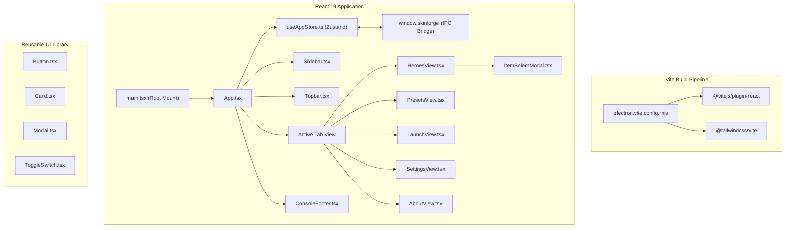

# React 19 + Tailwind CSS v4 Frontend Migration Implementation Plan

> **For agentic workers:** REQUIRED SUB-SKILL: Use superpowers:subagent-driven-development to implement this plan task-by-task. Steps use checkbox (`- [ ]`) syntax for tracking.

**Goal:** Migrate Dota 2 SkinForge frontend to React 19, TypeScript, and Tailwind CSS v4 with reusable UI components, centralized Zustand state, and 100% smoke test compatibility.

**Architecture:** Electron-Vite serves React 19 with `@vitejs/plugin-react` and `@tailwindcss/vite`. Reusable primitives (`<Button>`, `<Modal>`, `<Card>`) encapsulate styling via Tailwind utility classes and Lucide vector icons. State is managed via a reactive Zustand store connected to the Electron IPC bridge (`window.skinforge`).

**Architecture Diagram:**



**Tech Stack:** React 19, `@vitejs/plugin-react`, Tailwind CSS v4, Lucide React, Zustand, clsx, tailwind-merge, TypeScript

**Spec:** [docs/superpowers/specs/2026-10-10-react19-tailwind-v4-frontend-design.md](file:///e:/My/dota2-skinforge/docs/superpowers/specs/2026-10-10-react19-tailwind-v4-frontend-design.md)

## Global Constraints

- Preserve exact DOM class names and IDs queried by `test/electron-smoke.js` (`.hero-item-thumb`, `.hero-list-item`, `.slot-card`, `.slot-thumb-img`, `#slotModalList`, `.slot-item-option`, `.sio-thumb-img`, `.mrf-btn`, `#btnPlayDota`, `#dotaRunningPill`, `.hf-btn`).
- Preserve live skinforge-icon:// protocol image loading and custom item SVG fallback generation.
- All 11 unit test suites and the Electron smoke test must pass with 0 errors (`npm test`).

---

### Task 1: Install React 19 Dependencies and Configure Vite

**Files:**

- Modify: `package.json`
- Modify: `electron.vite.config.mjs:1-50`

- [ ] **Step 1: Install React 19, Lucide, Zustand, and utility packages**

Run: `npm install react@^19.0.0 react-dom@^19.0.0 lucide-react@^0.475.0 zustand@^5.0.3 clsx@^2.1.1 tailwind-merge@^3.0.1`
Run: `npm install -D @types/react@^19.0.0 @types/react-dom@^19.0.0 @vitejs/plugin-react@^4.3.4`

- [ ] **Step 2: Add react plugin to electron.vite.config.mjs**

```javascript
import react from '@vitejs/plugin-react'
// In renderer plugins:
renderer: {
  plugins: [
    react(),
    tailwindcss(),
    // ...
```

- [ ] **Step 3: Test build with Vite**

Run: `npm run build`
Expected: Succeeds without build errors.

- [ ] **Step 4: Commit**

```bash
git add package.json package-lock.json electron.vite.config.mjs
git commit -m "build: install react 19, lucide-react, zustand and configure vite plugin"
```

---

### Task 2: Build Reusable UI Component Primitives

**Files:**

- Create: `src/renderer/components/ui/Button.tsx`
- Create: `src/renderer/components/ui/Card.tsx`
- Create: `src/renderer/components/ui/Modal.tsx`
- Create: `src/renderer/components/ui/ToggleSwitch.tsx`

- [ ] **Step 1: Implement Button.tsx with variants**

Create `<Button>` supporting variants: `primary`, `play`, `ghost`, `danger`, `secondary`, `icon`, and sizes `sm`, `md`, `lg`.

- [ ] **Step 2: Implement Card.tsx, Modal.tsx, and ToggleSwitch.tsx**

Build modal dialog overlay with ESC dismissal, card container with backdrop blur, and toggle switch.

- [ ] **Step 3: Verify TypeScript compilation**

Run: `npm run typecheck`
Expected: 0 errors.

- [ ] **Step 4: Commit**

```bash
git add src/renderer/components/ui/
git commit -m "feat(ui): add reusable Button, Card, Modal, and ToggleSwitch primitives"
```

---

### Task 3: Build Reactive Store and IPC Bridge Integration

**Files:**

- Create: `src/renderer/state/useAppStore.ts`

- [ ] **Step 1: Implement useAppStore with Zustand**

Manage active tab, category, heroes list, selected hero, slot equipment state, presets, settings, logs, and installation status.
Wire window.skinforge IPC calls (`getInitialData`, `checkStatus`, `equipSlot`, `readSettings`, `writeSettings`, `onInstallProgress`).

- [ ] **Step 2: Verify store type safety**

Run: `npm run typecheck`
Expected: 0 errors.

- [ ] **Step 3: Commit**

```bash
git add src/renderer/state/useAppStore.ts
git commit -m "feat(state): create reactive Zustand store with IPC bridge"
```

---

### Task 4: Implement Sidebar, Topbar, and App Shell

**Files:**

- Create: `src/renderer/components/Sidebar.tsx`
- Create: `src/renderer/components/Topbar.tsx`
- Create: `src/renderer/App.tsx`
- Create: `src/renderer/main.tsx`
- Modify: `src/renderer/index.html`

- [ ] **Step 1: Create Sidebar.tsx with navigation categories and live status dot**

Display branding, categories with Lucide icons, status pill, and path string.

- [ ] **Step 2: Create Topbar.tsx with Play button, Apply Mods, Restore, and Refresh**

Include `#dotaRunningPill`, `#btnPlayDota`, `#btnApplyAll`, `#btnRestore`, `#btnRefreshTop`.

- [ ] **Step 3: Create App.tsx and mount in main.tsx**

Clean up `index.html` to mount `<div id="root"></div>` and `<script type="module" src="./main.tsx"></script>`.

- [ ] **Step 4: Commit**

```bash
git add src/renderer/components/Sidebar.tsx src/renderer/components/Topbar.tsx src/renderer/App.tsx src/renderer/main.tsx src/renderer/index.html
git commit -m "feat(shell): implement React App shell, Sidebar, and Topbar"
```

---

### Task 5: Implement HeroesView, SlotEditor, and ItemSelectModal

**Files:**

- Create: `src/renderer/components/HeroesView.tsx`
- Create: `src/renderer/components/HeroList.tsx`
- Create: `src/renderer/components/SlotEditor.tsx`
- Create: `src/renderer/components/ItemSelectModal.tsx`

- [ ] **Step 1: Implement HeroList.tsx with search and attribute filters**

Render `.hero-list-item`, `.hero-item-thumb`, and attribute filter buttons `.hf-btn`.

- [ ] **Step 2: Implement SlotEditor.tsx with slot cards and item thumbnails**

Render portrait, unlock all slots, and `.slot-card` with `.slot-thumb-img`.

- [ ] **Step 3: Implement ItemSelectModal.tsx with rarity filters and grid**

Render search, rarity pills `.mrf-btn[data-rarity="..."]`, and grid `#slotModalList` with `.slot-item-option` and `.sio-thumb-img`.

- [ ] **Step 4: Commit**

```bash
git add src/renderer/components/HeroesView.tsx src/renderer/components/HeroList.tsx src/renderer/components/SlotEditor.tsx src/renderer/components/ItemSelectModal.tsx
git commit -m "feat(cosmetics): implement HeroesView, SlotEditor, and ItemSelectModal"
```

---

### Task 6: Implement Presets, Launch, Settings, About, and Console

**Files:**

- Create: `src/renderer/components/PresetsView.tsx`
- Create: `src/renderer/components/LaunchView.tsx`
- Create: `src/renderer/components/SettingsView.tsx`
- Create: `src/renderer/components/AboutView.tsx`
- Create: `src/renderer/components/ConsoleFooter.tsx`

- [ ] **Step 1: Implement PresetsView, LaunchView, SettingsView, and AboutView**

Support preset management, Steam launch tweaks, directory config, and cache clearing.

- [ ] **Step 2: Implement ConsoleFooter.tsx**

Expandable activity console drawer with real-time log output.

- [ ] **Step 3: Commit**

```bash
git add src/renderer/components/PresetsView.tsx src/renderer/components/LaunchView.tsx src/renderer/components/SettingsView.tsx src/renderer/components/AboutView.tsx src/renderer/components/ConsoleFooter.tsx
git commit -m "feat(views): implement Presets, Launch, Settings, About, and ConsoleFooter"
```

---

### Task 7: Full Verification & Automated Smoke Testing

**Files:**

- Test: All test suites in `test/*.test.js`

- [ ] **Step 1: Run typecheck and lint**

Run: `npm run typecheck && npm run lint`
Expected: 0 errors, 0 warnings.

- [ ] **Step 2: Run complete test suite and Electron smoke test**

Run: `npm test`
Expected: 187 heroes loaded, hero thumbnails verified, slot cards clicked, modal item images verified, all 11 test suites PASS cleanly.

- [ ] **Step 3: Final commit**

```bash
git commit --allow-empty -m "chore: verify React 19 + Tailwind CSS v4 migration passes all tests"
```
