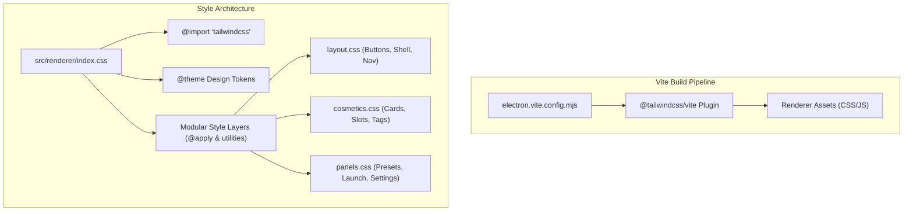

# Tailwind CSS v4 Migration Implementation Plan

> **For agentic workers:** REQUIRED SUB-SKILL: Use superpowers:subagent-driven-development to implement this plan task-by-task. Steps use checkbox (`- [ ]`) syntax for tracking.

**Goal:** Integrate Tailwind CSS v4 into Dota 2 SkinForge via `@tailwindcss/vite`, configuring theme design tokens and refactoring existing CSS files into Tailwind utilities and `@apply` component layers while maintaining 100% aesthetic and test fidelity.

**Architecture:** Tailwind CSS v4 is integrated natively through the `@tailwindcss/vite` plugin inside Electron-Vite's renderer build pipeline. Design tokens (dark surfaces, neon accents, Dota attribute colors) are defined in `@theme` in `index.css`, allowing both direct utility classes in markup and `@apply` in modular stylesheet components.

**Architecture Diagram:**



**Tech Stack:** Tailwind CSS v4, `@tailwindcss/vite`, Electron-Vite, Vite 7.3, TypeScript, CSS

**Spec:** [docs/superpowers/specs/2026-10-10-tailwind-v4-migration-design.md](file:///e:/My/dota2-skinforge/docs/superpowers/specs/2026-10-10-tailwind-v4-migration-design.md)

## Global Constraints

- Do not remove or alter semantic IDs or classes queried by TypeScript (`.snav-btn`, `.slot-card`, `.hero-card`, `.btn-play`, `#btnPlayDota`, `#dotaRunningPill`, `.hf-btn`).
- Preserve dark gaming aesthetic, glowing box-shadows, and Dota attribute colors.
- Maintain passing state for all 11 test suites and the Electron smoke test (`npm test`).

---

### Task 1: Install Tailwind CSS v4 and Configure Vite Plugin

**Files:**

- Modify: `package.json`
- Modify: `electron.vite.config.mjs:1-55`

**Interfaces:**

- Consumes: Vite renderer configuration in `electron.vite.config.mjs`
- Produces: Tailwind CSS v4 build support in Vite

- [ ] **Step 1: Install Tailwind v4 and Vite plugin dependencies**

Run: `npm install -D tailwindcss@^4.0.0 @tailwindcss/vite@^4.0.0`
Expected: Successfully installs packages and updates `package.json` and `package-lock.json`.

- [ ] **Step 2: Add tailwindcss plugin to electron.vite.config.mjs**

```javascript
import tailwindcss from '@tailwindcss/vite'
// In renderer configuration:
renderer: {
  root: resolve(projectRoot, 'src/renderer'),
  plugins: [
    tailwindcss(),
    serveStaticFolder('assets', resolve(projectRoot, 'assets')),
    serveStaticFolder('data', resolve(projectRoot, 'data')),
    copyStaticFolderPlugin([...])
  ],
  // ...
}
```

- [ ] **Step 3: Verify build without syntax errors**

Run: `npm run build`
Expected: Bundles successfully.

- [ ] **Step 4: Commit**

```bash
git add package.json package-lock.json electron.vite.config.mjs
git commit -m "build: install tailwindcss v4 and configure vite plugin"
```

---

### Task 2: Configure Theme Tokens in `index.css`

**Files:**

- Modify: `src/renderer/index.css:1-12`

**Interfaces:**

- Consumes: `@tailwindcss/vite`
- Produces: SkinForge theme design tokens (`bg-bg-app`, `text-accent-purple`, `border-border-subtle`, etc.)

- [ ] **Step 1: Update index.css with @import "tailwindcss" and @theme tokens**

```css
@import 'tailwindcss';

@theme {
  --color-bg-app: #080a10;
  --color-bg-sidebar: #0c0f18;
  --color-bg-surface: #101422;
  --color-bg-surface-elevated: #161c2e;
  --color-bg-card: rgba(18, 24, 38, 0.72);
  --color-bg-card-hover: rgba(28, 38, 60, 0.88);
  --color-bg-glass: rgba(14, 18, 29, 0.85);

  --color-border-subtle: rgba(255, 255, 255, 0.07);
  --color-border-light: rgba(255, 255, 255, 0.13);
  --color-border-focus: rgba(139, 92, 246, 0.55);

  --color-accent-purple: #8b5cf6;
  --color-accent-violet: #7c3aed;
  --color-accent-cyan: #06b6d4;
  --color-accent-gold: #f59e0b;
  --color-accent-amber: #d97706;
  --color-accent-rose: #f43f5e;
  --color-accent-emerald: #10b981;

  --color-attr-str: #ef4444;
  --color-attr-agi: #10b981;
  --color-attr-int: #06b6d4;
  --color-attr-uni: #a855f7;

  --font-sans: 'Inter', -apple-system, BlinkMacSystemFont, 'Segoe UI', Roboto, sans-serif;
  --font-mono: 'JetBrains Mono', 'Fira Code', monospace;
}

@import './styles/variables.css';
@import './styles/layout.css';
@import './styles/cosmetics.css';
@import './styles/panels.css';
@import './styles/console.css';
@import './styles/modals.css';
```

- [ ] **Step 2: Test building CSS bundle**

Run: `npm run build`
Expected: Output CSS generates cleanly with Tailwind utilities included.

- [ ] **Step 3: Commit**

```bash
git add src/renderer/index.css
git commit -m "style: configure tailwind v4 theme tokens and master import"
```

---

### Task 3: Modernize Layout & Buttons Using Tailwind and `@apply`

**Files:**

- Modify: `src/renderer/styles/layout.css:320-415`

**Interfaces:**

- Consumes: Tailwind utilities and theme colors
- Produces: Streamlined component definitions with `@apply`

- [ ] **Step 1: Refactor .btn and button variants with @apply**

```css
.btn {
  @apply inline-flex items-center justify-center gap-2 px-4 py-2 rounded-lg text-[13px] font-semibold cursor-pointer border-none outline-none select-none transition-all;
}

.btn-primary {
  @apply text-white;
  background: linear-gradient(135deg, #8b5cf6 0%, #6d28d9 100%);
  box-shadow: 0 2px 10px rgba(109, 40, 217, 0.35);
}

.btn-primary:hover:not(:disabled) {
  @apply -translate-y-px;
  background: linear-gradient(135deg, #9d71f7 0%, #7c3aed 100%);
  box-shadow: 0 4px 16px rgba(109, 40, 217, 0.5);
}

.btn-play {
  @apply text-white font-bold tracking-[0.3px];
  background: linear-gradient(135deg, #10b981 0%, #059669 100%);
  box-shadow: 0 2px 10px rgba(16, 185, 129, 0.35);
}

.btn-play:hover:not(:disabled) {
  @apply -translate-y-px;
  background: linear-gradient(135deg, #34d399 0%, #10b981 100%);
  box-shadow: 0 4px 18px rgba(16, 185, 129, 0.55);
}

.btn-ghost {
  @apply text-[var(--text-secondary)] border border-[var(--border-subtle)];
  background: rgba(255, 255, 255, 0.05);
}

.btn-ghost:hover:not(:disabled) {
  @apply text-[var(--text-main)] border-[var(--border-light)];
  background: rgba(255, 255, 255, 0.09);
}

.btn-danger {
  @apply text-red-400 border border-rose-500/30;
  background: rgba(244, 63, 94, 0.15);
}

.btn-sm {
  @apply px-3 py-1.5 text-xs rounded-md;
}

.btn-icon {
  @apply w-[34px] h-[34px] p-2 rounded-lg text-[var(--text-secondary)] border border-[var(--border-subtle)];
  background: rgba(255, 255, 255, 0.05);
}
```

- [ ] **Step 2: Refactor Topbar and Shell layout rules**

Streamline `.app-shell`, `.topbar`, `.topbar-right`, `.running-pill`, and `.sidebar-status-block` using Tailwind flexbox and spacing utilities.

- [ ] **Step 3: Run build and lint**

Run: `npm run build && npm run lint`
Expected: PASS with 0 errors.

- [ ] **Step 4: Commit**

```bash
git add src/renderer/styles/layout.css
git commit -m "style: modernize layout and button components with tailwind v4 @apply"
```

---

### Task 4: Modernize Panels, Cards & Cosmetics Styles

**Files:**

- Modify: `src/renderer/styles/cosmetics.css`
- Modify: `src/renderer/styles/panels.css`

**Interfaces:**

- Consumes: Tailwind v4 grid, flex, rounded, and transition utilities
- Produces: Refactored cosmetic card and panel layouts

- [ ] **Step 1: Refactor .hero-card and .slot-card with Tailwind @apply**

Convert flex/relative/overflow/rounded declarations to `@apply relative flex flex-col rounded-[10px] overflow-hidden cursor-pointer transition-all`.

- [ ] **Step 2: Refactor tweak-card and preset-card with Tailwind @apply**

Standardize padding, border, and hover utility definitions.

- [ ] **Step 3: Run build and typecheck**

Run: `npm run build && npm run typecheck`
Expected: PASS with 0 errors.

- [ ] **Step 4: Commit**

```bash
git add src/renderer/styles/cosmetics.css src/renderer/styles/panels.css
git commit -m "style: refactor cosmetic cards and panel styles with tailwind v4"
```

---

### Task 5: End-to-End Verification & Automated Smoke Testing

**Files:**

- Test: `test/electron-smoke.js`
- Test: All test suites in `test/*.test.js`

**Interfaces:**

- Consumes: Complete built application with Tailwind CSS v4
- Produces: Verified 100% test pass status

- [ ] **Step 1: Run typecheck and lint**

Run: `npm run typecheck && npm run lint`
Expected: 0 errors, 0 warnings.

- [ ] **Step 2: Run complete test suite and Electron smoke test**

Run: `npm test`
Expected: All 11 unit test suites pass, Electron smoke test passes with 187 heroes loaded, all slot cards and modal image thumbs functional.

- [ ] **Step 3: Final commit**

```bash
git commit --allow-empty -m "chore: verify tailwind css v4 migration passes all tests"
```
