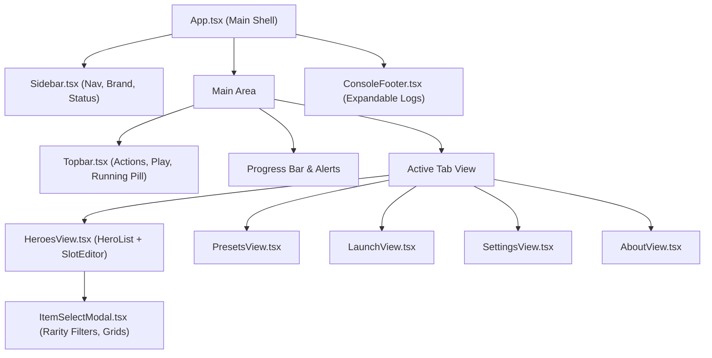

# Design Spec: React 19 + Tailwind CSS v4 Frontend Architecture

**Date:** 2026-10-10  
**Status:** Approved  
**Author:** Antigravity & User

---

## 1. Objective & Scope

Migrate the Dota 2 SkinForge Electron frontend from imperative Vanilla DOM manipulation to a modern, reactive **React 19 + TypeScript + Tailwind CSS v4** component architecture.

### Key Goals:

1. **Reusable UI Components**: Introduce `<Button>`, `<Card>`, `<Modal>`, and `<ToggleSwitch>` styled with Tailwind v4 utility classes and Lucide vector icons, completely eliminating repetitive class definitions.
2. **Reactive State**: Implement a centralized reactive store (Zustand) managing hero selection, active cosmetics, presets, live Dota status, and log output.
3. **Preserve Gaming Aesthetics**: Retain the dark obsidian/slate theme, neon glow effects (`accent-purple`, `accent-cyan`, `accent-emerald`), and Dota attribute colors.
4. **100% Smoke Test Compatibility**: Maintain all DOM query selector classes and IDs (`.hero-item-thumb`, `.slot-card`, `.slot-thumb-img`, `#slotModalList`, `.slot-item-option`, `.mrf-btn`, `#btnPlayDota`, `#dotaRunningPill`) so that the automated test suite (`npm test`) continues to pass without regressions.

---

## 2. Technology Stack & Build Pipeline

- **UI Framework:** React 19 (`react`, `react-dom`)
- **TypeScript Types:** `@types/react`, `@types/react-dom`
- **Vite Integration:** `@vitejs/plugin-react` in [electron.vite.config.mjs](file:///e:/My/dota2-skinforge/electron.vite.config.mjs)
- **Styling:** Tailwind CSS v4 (`tailwindcss`, `@tailwindcss/vite`) with `@theme` design tokens
- **Icons:** `lucide-react`
- **Utility Helpers:** `clsx`, `tailwind-merge`
- **State Management:** `zustand`

---

## 3. Component Architecture

### 3.1 Reusable UI Primitives (`src/renderer/components/ui/`)

- **`Button.tsx`**:
  - Props: `variant` ('primary' | 'play' | 'ghost' | 'danger' | 'secondary' | 'icon'), `size` ('sm' | 'md' | 'lg'), `glow` (boolean).
  - Styled with Tailwind gradients, hover transforms (`hover:-translate-y-px`), and focus states.
- **`Card.tsx`**:
  - Dark glassmorphic background with border tokens and hover elevation.
- **`Modal.tsx`**:
  - Accessible dialog overlay with blur backdrop, close button, and keyboard ESC listener.
- **`ToggleSwitch.tsx`**:
  - Clean toggle switch for boolean settings.

### 3.2 Feature Components (`src/renderer/components/`)

- **`Sidebar.tsx`**:
  - Displays brand icon with gradient glow, category selection buttons (`data-tab`, `data-category`), and live installation status dot (`.status-indicator`).
- **`Topbar.tsx`**:
  - Shows title/subtitle, `#dotaRunningPill` when game is detected, `#btnPlayDota`, `#btnApplyAll`, and `#btnRestore`.
- **`HeroList.tsx`**:
  - Instant search, attribute filter buttons (`.hf-btn[data-attr="..."]`), and hero list items with `.hero-item-thumb`.
- **`SlotEditor.tsx`**:
  - Hero portrait, Persona badge, unlock best set button, and per-slot equipment cards (`.slot-card`, `.slot-thumb-img`).
- **`ItemSelectModal.tsx`**:
  - Cosmetic item selection modal with search input, rarity filter pills (`.mrf-btn[data-rarity="..."]`), and item grid (`#slotModalList`, `.slot-item-option`, `.sio-thumb-img`).
- **`LaunchView.tsx`**:
  - Steam launch flags checklist, generated options string, and direct "Play Dota 2" button.
- **`SettingsView.tsx`**:
  - Game path selection, mod folder naming, icon cache stats display, and cache clear action.
- **`ConsoleFooter.tsx`**:
  - Collapsible activity console drawer with real-time log outputs.

---

## 4. State Management (`src/renderer/state/`)

### `useAppStore.ts`

Zustand reactive store managing:

- Current active navigation tab & category.
- Heroes list & currently selected hero.
- Equipped slot items (`heroSlots: Record<string, Record<string, EquippedItem>>`).
- Settings (Dota 2 path, launch options, auto-detect).
- Pipeline status & logs.
- Modal open/close state.

---

## 5. Verification & Testing

1. **Compilation**:
   - `npm run build` bundles SSR and client output cleanly with React and Tailwind v4.
2. **Typecheck & Linter**:
   - `npm run typecheck` (`tsc -b --noEmit`) passes with 0 errors.
   - `npm run lint` passes with 0 errors and 0 warnings.
3. **Automated Smoke Testing**:
   - `npm test` runs all 11 unit test suites and `test/electron-smoke.js`.
   - Verifies 187 heroes loaded, hero thumbnails rendered, slot click interactions, modal item filtering by rarity, and non-hero items (couriers, creeps, HUDs, loading screens).
